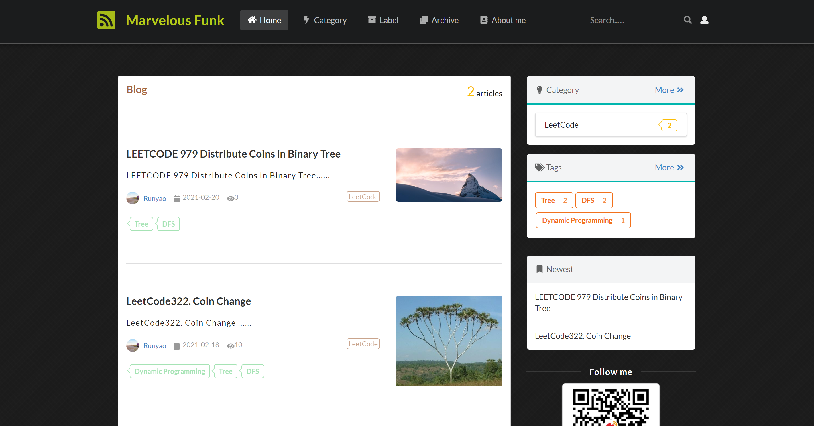
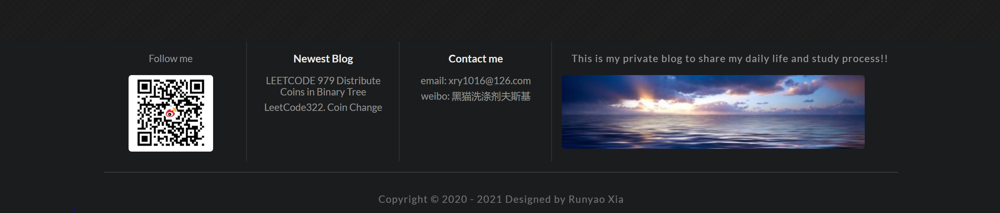
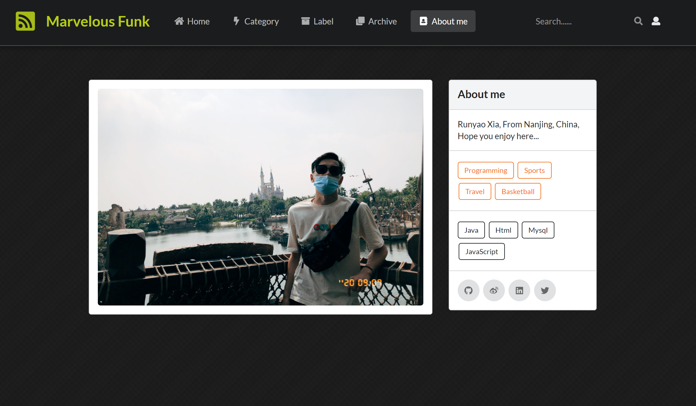

#Clean and simple My Blog with Spring Boot.
==
Back-end
=
Framework: **Spring Boot** 
Data Persistence: **JPA** 
HTML template: **Thymeleaf** 
Markdown: **Commonmark** 

Front-end
===
JS Framework: **JQuery** 
CSS Framework: **Semantic UI**  

****
 
 
 
 
 
 
-----
##User Management 
-----
 
 
 
 
 
